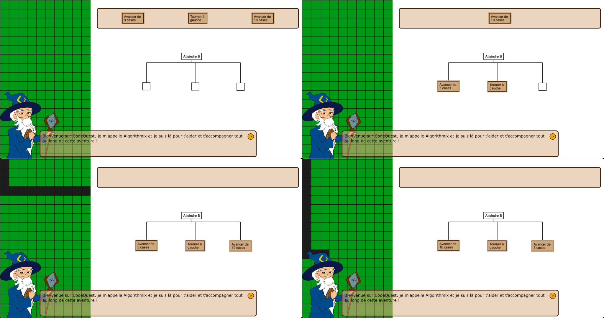

# Code Quest

L’application CodeQuest est un jeu permettant d’apprendre l’informatique tout en s’amusant.
Le contenu présenté dans l’application est basé sur la même approche que le programme universitaire 
que nous suivons en BUT Informatique, pour ce qui relève de l’algorithmique et plusieurs langages 
de programmation mais aussi les bonnes pratiques. 

L’application s’adresse aux débutants n’ayant aucune connaissance en informatique, 
mais aussi à des personnes ayant des connaissances plus ou moins avancées en 
informatique et en programmation.

Plusieurs niveaux de difficulté sont proposés aux joueurs afin d’accompagner au mieux un débutant, 
de consolider les connaissances d’un profil intermédiaire et de challenger les experts.

## Aperçu d'un niveau du jeu

## Organisation des dossiers
* Algorithmes :
  * Probleme_1_Dessin_algorithme :
    - algo_1 ( algorithme principal de cette problématique )
    - algo_1.1 ( création des éléments graphiques représentants les noeuds à déplacer )
    - algo_1.2 ( création des éléments graphiques représentants les zones de drop )
    - algo_1.3 ( création des objets représentants les noeuds )
    - algo_1.4 ( dessiner tous les noeuds sur leur élément graphique respectif )
  * Probleme_2_Interpretation_reponses_utilisateur :
* Docs : 
  contient la documentation liée au projet.
* Spécifiaction 
* Src :
  * backend :
    contient les fichiers du backend de l'application.
  * frontend :
    contient les fichiers du frontend de l'application.
    (le javascript, les images)
  * .gitignore
  * index.html

## Equipe projet
* [Dumolié Alexis](https://github.com/AlexisDumolie)
* [Gratchev Grigori](https://github.com/jrijori)
* [Kessentini Nour](https://github.com/nourkessentini)
* [Laborde Romain](https://github.com/RomLabo)
* [Moreno Alex](https://github.com/KyoooCode)

## Langages utilisés
### Frontend :
* Html
* Css
* Javascript
### Backend :
* Php

