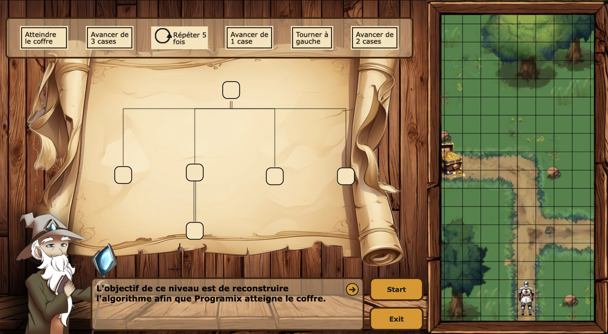

# Code Quest

L’application CodeQuest est un jeu permettant d’apprendre l’informatique tout en s’amusant.
Le contenu présenté dans l’application est basé sur la même approche que le programme universitaire 
que nous suivons en BUT Informatique, pour ce qui relève de l’algorithmique et plusieurs langages 
de programmation mais aussi les bonnes pratiques. 

L’application s’adresse aux débutants n’ayant aucune connaissance en informatique, 
mais aussi à des personnes ayant des connaissances plus ou moins avancées en 
informatique et en programmation.

Plusieurs niveaux de difficulté sont proposés aux joueurs afin d’accompagner au mieux un débutant, 
de consolider les connaissances d’un profil intermédiaire et de challenger les experts.

## Lien vers le prototype
***Le prototype n'est pas accessible pour des personnes extérieurs à l'IUT de Bayonne et du Pays Basque.***
[Tester le prototype](http://lakartxela.iutbayonne.univ-pau.fr/~rlaborde003/index.html)

## Tester le prototype via Docker
`docker-compose up -d`

## Lien vers la documentation
[Documentation](https://codequestapp.github.io/main/)

## Aperçu d'un niveau du jeu

## Organisation des dossiers
* Algorithmes :
  * Probleme_1_Dessin_algorithme :
    - algo_1 ( algorithme principal de cette problématique )
    - algo_1.1 ( création des éléments graphiques représentants les noeuds à déplacer )
    - algo_1.2 ( création des éléments graphiques représentants les zones de drop )
    - algo_1.3 ( création des objets représentants les noeuds )
    - algo_1.4 ( dessiner tous les noeuds sur leur élément graphique respectif )
  * Probleme_2_Interpretation_reponses_utilisateur :
* Docs : 
    - contient le code de la documentation généré avec jsdoc ( voir lien ci-dessus ).
* Spécifiaction 
* Src :
  * backend :
    - algoMain.json ( fichier de données pour simuler la récupération en base de données )
  * frontend :
    * css : 
      * prefixed : 
        - style.css ( fichier css minifié et préfixé pour la compatibilité navigateur )
      - style.css ( fichier css principal minifié )
      - style.css.map ( fichier généré lors de la minification )
    * img :
      - perso.png ( personnage principal du level algorithmique )
      - symboles.png ( symboles utilisés pour le dessin des noeuds )
    * js :
      - App.js ( fichier contenant le code javascript princpal de l'application )
      - LevelAlgo.js ( fichier contenant le code javascript nécessaire au level algorithmique )
      - Node.js ( fichier contenant le code de la class Node représentant un noeud algorithmique )
      - Utilities.js ( fichier contenant des fonctions utilitaires qui sont utilisées dans l'application ) 
    * sass :
      * base : 
        - animations.scss ( contient toutes les animations css )
        - base.scss ( contient les instructions css communes à toutes les pages )
      * layout :
        - footer.scss ( contient les instructions css du pied de page )
        - header.scss ( contient les instruction css de l'entête )
      * pages :
        - home.scss ( contient les instructions css de la page d'accueil )
        - level.scss ( contient les instructions css de la page level ) 
      * utils :
        - variables.scss ( contient les variables css globales )
        - mixins.scss ( contient des morceaux de code paramétrable et réutilisable)
      - main.scss ( fichier scss principal contenant toutes les inclusions )
  * .gitignore
  * index.html
  * level_algo.html
  
## Equipe projet
* [Dumolié Alexis](https://github.com/AlexisDumolie)
* [Gratchev Grigori](https://github.com/jrijori)
* [Kessentini Nour](https://github.com/nourkessentini)
* [Laborde Romain](https://github.com/RomLabo)
* [Moreno Alex](https://github.com/KyoooCode)

## Langages utilisés
### Frontend :
* Html
* Css
* Javascript
### Backend :
* Php

